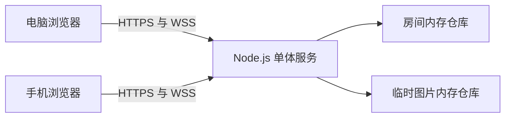

# 跨端信息传递工具技术设计

Feature Name: cross-device-transfer
Updated: 2026-07-11

## 描述

系统是一个面向电脑与手机浏览器的双设备临时传输工具。首版提供二维码或配对码配对、双向文字发送、10 MB 以内图片发送、断线恢复和主动结束会话。系统不提供账号、长期历史记录和多设备群组。

## 架构



服务端使用 TypeScript、Fastify 和 WebSocket。Vite 构建的轻量前端由同一个服务托管。房间、消息和图片均保存在进程内存中，房间关闭或服务重启后释放。生产环境由现有反向代理提供 HTTPS，并将 `/api` 与 `/ws` 转发到应用服务。

## 组件与接口

### Web 客户端

- `HomeView`：提供创建房间和输入配对码入口。
- `PairingView`：展示二维码、配对码、倒计时及加入确认。
- `TransferView`：展示连接状态、消息列表、文字输入、图片选择和结束会话操作。
- `TransferClient`：管理 HTTP 请求、WebSocket 连接、心跳、重连和消息确认。
- `SessionStore`：在当前标签页内维护房间令牌、设备令牌和消息视图。

### HTTP API

- `POST /api/rooms`：创建房间，返回房间标识、配对码、创建方令牌和过期时间。
- `POST /api/rooms/join`：使用配对码加入，返回加入方令牌和房间状态。
- `POST /api/rooms/:roomId/images`：验证房间令牌并接收单张图片，限制格式与 10 MB 大小。
- `GET /api/rooms/:roomId/images/:imageId`：验证房间令牌后读取会话期图片。
- `DELETE /api/rooms/:roomId`：创建方或加入方主动关闭房间。
- `GET /health`：返回应用存活状态。

### WebSocket 协议

连接地址为 `/ws?roomId={roomId}&deviceToken={deviceToken}`。

客户端消息：

- `text.send`：发送文字和客户端消息标识。
- `image.send`：广播已上传图片的标识、文件名、MIME 类型和大小。
- `message.retry`：重新提交失败消息。
- `session.close`：主动结束会话。
- `ping`：连接保活。

服务端消息：

- `room.paired`：第二台设备加入成功。
- `peer.online` 与 `peer.offline`：对端连接状态变化。
- `message.deliver`：投递文字或图片元数据。
- `message.ack`：确认消息已由服务端接收。
- `session.closed`：房间已结束。
- `error`：返回结构化错误码与可展示信息。

### 房间服务

`RoomService` 负责创建、加入、令牌校验、连接绑定、断线宽限和房间销毁。后台清理器按固定间隔释放过期待配对房间、断线超时房间和孤立图片。

### 限流服务

`RateLimiter` 使用内存滑动窗口记录来源和连接行为，分别限制无效配对请求和消息发送频率。生产反向代理需要传递可信客户端地址。

## 数据模型

```typescript
type RoomStatus = 'waiting' | 'paired' | 'closing'

interface Room {
  id: string
  pairingCodeHash: string
  status: RoomStatus
  createdAt: number
  pairingExpiresAt: number
  disconnectExpiresAt?: number
  devices: Map<string, DeviceSession>
  messages: TransferMessage[]
  images: Map<string, ImageAsset>
}

interface DeviceSession {
  id: string
  tokenHash: string
  connected: boolean
  lastSeenAt: number
}

interface TransferMessage {
  id: string
  clientMessageId: string
  senderDeviceId: string
  kind: 'text' | 'image'
  text?: string
  imageId?: string
  createdAt: number
}

interface ImageAsset {
  id: string
  fileName: string
  mimeType: 'image/jpeg' | 'image/png' | 'image/webp' | 'image/gif'
  size: number
  bytes: Buffer
  createdAt: number
}
```

令牌与配对码只以摘要形式存储。客户端消息标识用于重连或重试时去重。图片对象只属于一个房间，并通过房间设备令牌访问。

## 正确性属性

1. 任意活动房间的设备数量在 0 至 2 之间。
2. 任意成功投递的消息都属于发送设备所在的活动房间。
3. 同一房间内相同 `clientMessageId` 最多生成一条消息。
4. 任意可读取图片都属于请求设备所在的活动房间。
5. 任意已关闭或已过期房间不再接受加入、消息或图片请求。
6. 任意成功接收的图片大小不超过 10 MB，且 MIME 类型属于允许集合。
7. 房间内消息顺序与服务端接收时间顺序一致。

## 错误处理

- 无效或过期配对码返回 `PAIRING_CODE_INVALID` 或 `ROOM_EXPIRED`。
- 房间已有两台设备时返回 `ROOM_FULL`。
- 无效令牌返回 `SESSION_UNAUTHORIZED`，不暴露房间是否存在。
- 超长文字返回 `TEXT_TOO_LONG`，空白文字返回 `TEXT_EMPTY`。
- 超限图片返回 `IMAGE_TOO_LARGE`，错误类型返回 `IMAGE_TYPE_UNSUPPORTED`。
- 限流触发时返回 `RATE_LIMITED` 和剩余等待秒数。
- WebSocket 断开时客户端进入重连状态，在 60 秒窗口内使用原令牌恢复。
- 服务端异常使用统一错误结构记录请求标识，客户端显示可恢复提示。

## 测试策略

- 单元测试覆盖房间状态转换、令牌校验、消息去重、图片验证和限流窗口。
- Property-based 测试验证设备数量上限、跨房间隔离、消息幂等和图片限制。
- API 集成测试覆盖创建、加入、图片上传读取、关闭和错误码。
- WebSocket 集成测试覆盖配对通知、双向投递、确认、断线和恢复。
- Playwright E2E 测试使用桌面与移动视口覆盖完整配对、文字和图片流程。
- 构建检查覆盖 TypeScript、lint、单元测试和生产构建。

## 部署约束

- 应用进程仅监听内部端口，公网入口统一通过 HTTPS 反向代理。
- `/api` 和 `/ws` 使用同源地址，避免跨域配置和移动浏览器安全限制。
- 单进程内存状态要求首版只运行一个应用实例。
- 进程内图片总量设置全局上限，达到上限时拒绝新图片上传并返回容量提示。
