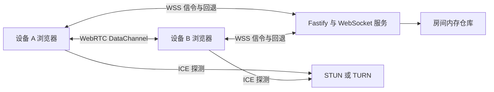
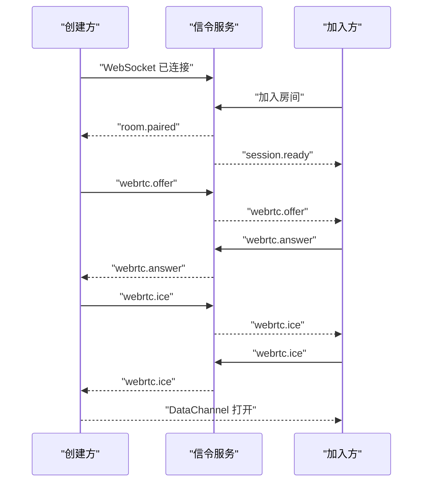

# WebRTC 直连传输技术设计

Feature Name: webrtc-data-transfer
Updated: 2026-07-19

## 描述

本功能在现有 AWindow 房间和 WebSocket 连接之上增加 WebRTC DataChannel。WebSocket 继续承担房间授权、信令、状态通知和自动回退；DataChannel 优先承担文字与图片字节传输。该设计保留现有 HTTP 图片上传和 WebSocket 消息发送能力，使受限网络和旧浏览器继续完成传输。

## 架构



连接建立流程：



创建方固定为 Offerer，加入方固定为 Answerer，避免双方同时创建 Offer。重连时由服务端在 `session.ready` 中返回设备角色，创建方发起新一轮协商。

## 组件与接口

### 客户端组件

#### TransferClient

现有 `TransferClient` 继续管理 HTTP、WebSocket、心跳和重连，并新增信令事件转发。`TransferClient` 不直接实现图片分块，以保持连接管理职责清晰。

#### PeerTransport

新增 `client/src/peer-transport.ts`：

- 创建和关闭 `RTCPeerConnection`。
- 根据设备角色创建 Offer 或处理 Offer。
- 收集、发送和应用 ICE 候选。
- 创建可靠、有序的 `RTCDataChannel`。
- 暴露 `connecting`、`direct`、`relayed`、`fallback` 和 `closed` 状态。
- 将收到的 DataChannel 帧交给 `TransferProtocol`。

DataChannel 配置：

```typescript
peerConnection.createDataChannel('awindow-transfer', {
  ordered: true,
})
```

可靠性由 SCTP 默认重传提供。应用层确认用于跨 DataChannel 和回退通道维持统一幂等语义。

#### TransferProtocol

新增 `client/src/transfer-protocol.ts`：

- 为文字和图片分配 `clientMessageId`。
- 编码和解析控制帧。
- 将图片切分为固定大小的二进制块。
- 维护发送队列、确认状态和重试计时器。
- 依据 `bufferedAmount` 实施背压。
- 在回退时调用现有 WebSocket 或 HTTP 接口。

建议初始参数：

```typescript
const IMAGE_CHUNK_BYTES = 32 * 1024
const BUFFER_HIGH_WATER_BYTES = 512 * 1024
const BUFFER_LOW_WATER_BYTES = 128 * 1024
const ACK_TIMEOUT_MS = 5_000
const NEGOTIATION_TIMEOUT_MS = 10_000
```

参数应集中定义，便于根据 Safari 和移动网络测试调整。

### 服务端组件

#### WebSocketGateway

`server/realtime/websocket-gateway.ts` 新增信令消息转发：

- `webrtc.offer`
- `webrtc.answer`
- `webrtc.ice`
- `webrtc.restart`
- `transfer.fallback`

服务端验证消息结构、房间授权、设备角色和消息大小后，仅向同房间另一台设备转发。服务端不解析 SDP 内容，也不把 SDP 或 ICE 候选写入日志和房间历史。

#### ICE 配置接口

新增 `GET /api/webrtc/config`，返回浏览器可用的 `RTCIceServer[]` 和连接参数。生产 TURN 凭据应由短时凭据服务生成；首个版本可以从受保护的环境变量读取固定凭据，并限制配置接口仅向已授权房间设备返回。

建议环境变量：

```text
WEBRTC_STUN_URLS
WEBRTC_TURN_URLS
WEBRTC_TURN_USERNAME
WEBRTC_TURN_CREDENTIAL
WEBRTC_NEGOTIATION_TIMEOUT_MS
```

### 共享协议

`shared/protocol.ts` 扩展客户端与服务端消息联合类型。信令负载设置长度上限，ICE 候选数量设置房间级上限，降低滥用和内存增长风险。

## 数据模型

### 信令消息

```typescript
interface WebRtcDescriptionMessage {
  type: 'webrtc.offer' | 'webrtc.answer'
  description: RTCSessionDescriptionInit
}

interface WebRtcIceMessage {
  type: 'webrtc.ice'
  candidate: RTCIceCandidateInit
}
```

### DataChannel 控制帧

控制帧使用 JSON 字符串，图片内容使用 `ArrayBuffer`。每个二进制分块以固定头部携带传输标识和序号，接收方可以按序写入预分配缓冲区。

```typescript
type TransferFrame =
  | { type: 'text'; messageId: string; text: string }
  | { type: 'image.start'; transferId: string; fileName: string; mimeType: string; size: number; chunkCount: number; sha256: string }
  | { type: 'image.complete'; transferId: string }
  | { type: 'ack'; messageId: string }
  | { type: 'resume'; confirmedMessageIds: string[]; partialImages: PartialImageState[] }
  | { type: 'cancel'; transferId: string; reason: string }

interface PartialImageState {
  transferId: string
  receivedChunks: number[]
}
```

图片块的线格式建议为：16 字节 UUID、4 字节块序号、剩余部分为图片字节。实现时使用 `DataView`，避免字符串 Base64 带来的约 33% 体积膨胀。

### 客户端会话状态

```typescript
interface PendingTransfer {
  messageId: string
  kind: 'text' | 'image'
  channel: 'webrtc' | 'fallback'
  status: 'queued' | 'sending' | 'awaiting-ack' | 'complete' | 'failed'
  attempts: number
}
```

消息正文和图片字节保存在当前页面内存。页面刷新后使用现有服务端回退历史恢复；后续版本可以使用 IndexedDB 支持刷新后的直连传输恢复。

## 传输流程

### 文字

1. 客户端生成 `clientMessageId` 并加入待确认队列。
2. 直连通道打开时发送 `text` 帧。
3. 接收方去重、渲染并返回 `ack`。
4. 超过 5 秒未确认时重发一次。
5. 第二次超时后使用现有 `text.send` 回退。

### 图片

1. 客户端读取文件并计算 SHA-256。
2. 客户端发送 `image.start` 控制帧。
3. 客户端以 32 KiB 分块发送二进制数据。
4. `bufferedAmount` 达到高水位时暂停，触发 `bufferedamountlow` 后继续。
5. 客户端发送 `image.complete`。
6. 接收方校验大小、块数和 SHA-256 后返回确认。
7. 校验失败、连接关闭或确认超时时调用现有图片上传 API 回退。

## 正确性属性

1. 同一房间只允许两个已授权设备交换信令。
2. 同一轮协商只有创建方生成 Offer。
3. 同一 `clientMessageId` 在接收界面最多显示一次。
4. 图片只有在大小、块数和 SHA-256 全部匹配后进入消息列表。
5. 通道切换保持原 `clientMessageId`，使 WebRTC 和回退投递共享去重语义。
6. 任意未完成图片占用的浏览器内存不超过单图限制与并发传输限制之和。
7. 房间关闭后所有 PeerConnection、DataChannel、对象 URL 和待处理计时器均被释放。

## 错误处理

- `WEBRTC_UNSUPPORTED`：浏览器缺少所需 API，直接启用回退。
- `WEBRTC_NEGOTIATION_TIMEOUT`：10 秒内未打开 DataChannel，启用回退。
- `WEBRTC_SIGNAL_INVALID`：服务端拒绝结构错误或超限信令。
- `WEBRTC_CHANNEL_CLOSED`：保留未确认传输并切换回退。
- `TRANSFER_CHECKSUM_MISMATCH`：丢弃接收缓冲并通过回退重发。
- `TRANSFER_BUFFER_LIMIT`：暂停新图片传输并提示当前传输仍在进行。
- `TURN_CONFIGURATION_UNAVAILABLE`：继续尝试可用 ICE 候选，超时后启用回退。

## 安全与隐私

- 信令沿用现有房间设备令牌授权。
- SDP 和 ICE 候选仅在房间两端之间短时转发。
- WebRTC 数据由 DTLS 加密。
- TURN 凭据使用短时有效配置，并通过 HTTPS 返回。
- 对信令消息设置单条大小、候选数量和发送频率限制。
- 对同时接收的图片数量和累计缓冲字节设置上限。
- 页面关闭和房间关闭时释放图片缓冲、对象 URL 和加密连接状态。

## 测试策略

### 单元测试

- 控制帧编码、解析和非法输入。
- 图片分块与重组的往返一致性。
- SHA-256 校验成功与失败。
- 背压高低水位切换。
- 消息确认、超时、重试和回退状态机。

### 服务端集成测试

- 同房间信令转发。
- 跨房间信令隔离。
- 未授权信令拒绝。
- SDP 大小、ICE 数量和发送频率限制。
- 重连后新一轮协商。

### 浏览器 E2E

- Chromium 双页面建立 DataChannel 并发送文字。
- 10 MB 边界图片分块传输和摘要验证。
- 模拟 ICE 失败后自动回退。
- 传输中关闭 DataChannel 后通过回退完成消息。
- 移动视口显示直连、回退和传输进度状态。

真实 STUN/TURN 连通性测试应在独立预发布环境执行，记录直连率、TURN 使用率、协商时间和失败原因。

## 实施顺序

1. 扩展共享信令协议和服务端转发测试。
2. 实现 `PeerTransport` 和本地双页面连接测试。
3. 实现文字直传、确认和 WebSocket 回退。
4. 实现图片分块、背压、摘要和 HTTP 回退。
5. 实现重连协商与会话缺失消息同步。
6. 增加 STUN/TURN 配置、指标和生产 E2E 验证。

## 参考资料

[^1]: WebRTC Getting Started - Data channels: https://webrtc.org/getting-started/data-channels
[^2]: WebRTC Getting Started - Peer connections and ICE: https://webrtc.org/getting-started/peer-connections
[^3]: 当前架构说明：`.monkeycode/docs/ARCHITECTURE.md`
[^4]: 当前共享协议：`shared/protocol.ts`
