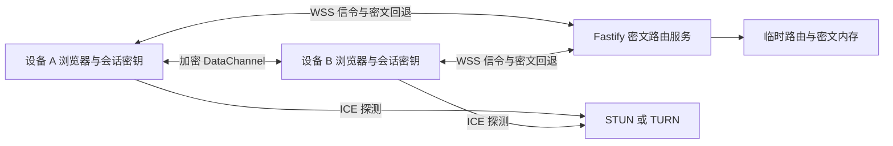
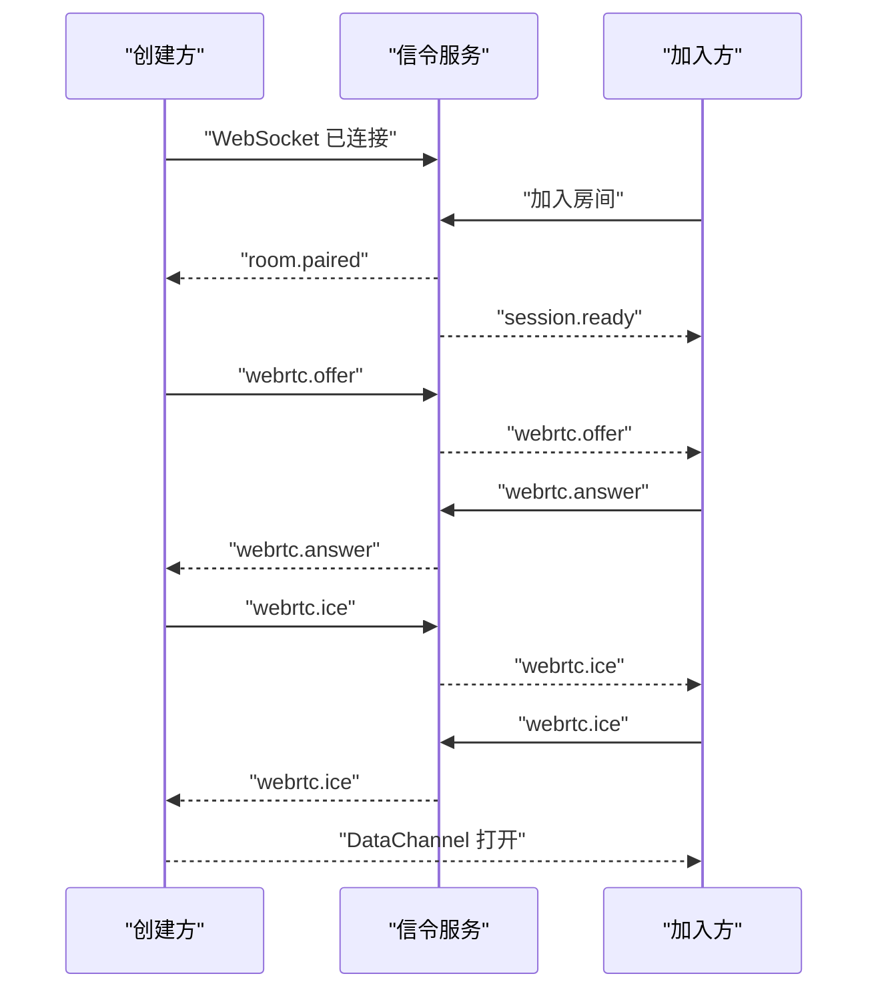

# WebRTC 直连与端到端加密技术设计

Feature Name: webrtc-data-transfer
Updated: 2026-07-29

## 描述

本功能在现有 AWindow 房间和 WebSocket 连接之上增加 WebRTC DataChannel 和应用层端到端加密。WebSocket 继续承担房间授权、信令、状态通知和自动回退；DataChannel 优先承担加密文字与图片字节传输。HTTP 与 WebSocket 回退只处理中转密文，使传输通道切换保持相同机密性边界。每个房间使用一次性浏览器密钥，二维码通过 URL Fragment 绑定密钥，配对码加入通过 12 位短验证码完成人工验证。

## 架构



连接建立流程：



创建方固定为 Offerer，加入方固定为 Answerer，避免双方同时创建 Offer。重连时由服务端在 `session.ready` 中返回设备角色，创建方发起新一轮协商。

## 组件与接口

### 客户端组件

#### TransferClient

现有 `TransferClient` 继续管理 HTTP、WebSocket、心跳和重连，并新增信令事件转发。`TransferClient` 不直接实现图片分块，以保持连接管理职责清晰。

#### PeerTransport

新增 `client/src/peer-transport.ts`：

- 创建和关闭 `RTCPeerConnection`。
- 根据设备角色创建 Offer 或处理 Offer。
- 收集、发送和应用 ICE 候选。
- 创建可靠、有序的 `RTCDataChannel`。
- 暴露 `connecting`、`direct`、`relayed`、`fallback` 和 `closed` 状态。
- 将收到的 DataChannel 帧交给 `TransferProtocol`。

DataChannel 配置：

```typescript
peerConnection.createDataChannel('awindow-transfer', {
  ordered: true,
})
```

可靠性由 SCTP 默认重传提供。应用层确认用于跨 DataChannel 和回退通道维持统一幂等语义。

#### TransferProtocol

新增 `client/src/transfer-protocol.ts`：

- 为文字和图片分配 `clientMessageId`。
- 在 `CryptoSession` 完成验证后编码和解析加密控制帧。
- 将图片切分为固定大小的二进制块。
- 维护发送队列、确认状态和重试计时器。
- 依据 `bufferedAmount` 实施背压。
- 在回退时调用现有 WebSocket 或 HTTP 接口。

#### CryptoSession

新增 `client/src/crypto-session.ts`，仅使用浏览器 Web Crypto API：

- 使用 `crypto.getRandomValues` 生成 256 位邀请秘密和 96 位消息随机数，并通过 `crypto.subtle.generateKey` 生成一次性 P-256 ECDH 密钥对。
- 导入、导出临时公钥并验证公钥认证标签。
- 使用 ECDH 共享秘密和邀请秘密执行 HKDF-SHA-256。
- 按设备角色派生 `creator-to-joiner`、`joiner-to-creator`、公钥认证和短验证码材料。
- 使用 AES-256-GCM 加密和认证全部内容载荷。
- 维护当前发送方向随机数集合与密钥代次。
- 在房间关闭、验证失败和页面卸载时释放可达密钥引用。

P-256 ECDH、HKDF-SHA-256 和 AES-256-GCM 均由目标浏览器的 Web Crypto API 提供。协议封装包含版本和算法标识，以支持未来迁移。

#### 邀请与验证流程

创建方在调用创建房间接口前生成邀请秘密。服务端返回的 `joinUrl` 只包含房间和配对码，客户端在生成二维码时附加 `#k=<base64url-secret>`。URL Fragment 由浏览器本地处理，不进入 HTTP 请求、反向代理日志或服务端路由。

二维码加入方读取邀请秘密后清除地址栏 Fragment，并使用 HMAC-SHA-256 认证房间标识、设备角色和临时公钥。手动配对码加入方没有邀请秘密，两端根据 ECDH 共享秘密派生 12 位短验证码；双方分别确认一致后才开放发送控件。

建议初始参数：

```typescript
const IMAGE_CHUNK_BYTES = 32 * 1024
const BUFFER_HIGH_WATER_BYTES = 512 * 1024
const BUFFER_LOW_WATER_BYTES = 128 * 1024
const ACK_TIMEOUT_MS = 5_000
const NEGOTIATION_TIMEOUT_MS = 10_000
```

参数应集中定义，便于根据 Safari 和移动网络测试调整。

### 服务端组件

#### WebSocketGateway

`server/realtime/websocket-gateway.ts` 新增信令消息转发：

- `webrtc.offer`
- `webrtc.answer`
- `webrtc.ice`
- `webrtc.restart`
- `transfer.fallback`

服务端验证消息结构、房间授权、设备角色和消息大小后，仅向同房间另一台设备转发。服务端不解析 SDP、公钥认证内容或加密信封，也不把 SDP、ICE 候选、公钥和密文写入日志。

现有 `text.send`、`image.send` 和图片 HTTP 模型调整为通用加密信封。由于房间数据仅驻留进程内存且当前没有外部协议消费者，本次直接迁移协议，不保留明文兼容分支。

#### ICE 配置接口

新增 `GET /api/webrtc/config`，返回浏览器可用的 `RTCIceServer[]` 和连接参数。生产 TURN 凭据应由短时凭据服务生成；首个版本可以从受保护的环境变量读取固定凭据，并限制配置接口仅向已授权房间设备返回。

建议环境变量：

```text
WEBRTC_STUN_URLS
WEBRTC_TURN_URLS
WEBRTC_TURN_USERNAME
WEBRTC_TURN_CREDENTIAL
WEBRTC_NEGOTIATION_TIMEOUT_MS
```

### 共享协议

`shared/protocol.ts` 扩展客户端与服务端消息联合类型。信令负载设置长度上限，ICE 候选数量设置房间级上限，降低滥用和内存增长风险。

## 数据模型

### 信令消息

```typescript
interface WebRtcDescriptionMessage {
  type: 'webrtc.offer' | 'webrtc.answer'
  description: RTCSessionDescriptionInit
}

interface WebRtcIceMessage {
  type: 'webrtc.ice'
  candidate: RTCIceCandidateInit
}
```

### DataChannel 控制帧

DataChannel 和服务器回退共享同一种加密信封。外层路由头使用受限 JSON，密文和图片内容使用 `ArrayBuffer`。每个二进制分块以固定头部携带临时传输标识、序号和加密信封，接收方可以按序写入预分配缓冲区。

```typescript
interface EncryptedEnvelope {
  version: 1
  keyGeneration: number
  messageId: string
  nonce: string
  ciphertext: string
}

type PlainTransferFrame =
  | { type: 'text'; messageId: string; text: string; padding: string }
  | { type: 'image.start'; transferId: string; fileName: string; mimeType: string; size: number; chunkCount: number; sha256: string }
  | { type: 'image.complete'; transferId: string }
  | { type: 'ack'; messageId: string }
  | { type: 'resume'; confirmedMessageIds: string[]; partialImages: PartialImageState[] }
  | { type: 'cancel'; transferId: string; reason: string }

interface PartialImageState {
  transferId: string
  receivedChunks: number[]
}
```

AES-GCM Additional Authenticated Data 固定包含协议版本、房间标识、发送角色、密钥代次和消息标识，防止密文跨房间、跨方向或跨消息重放。文字明文按 1 KiB、4 KiB、16 KiB 档位填充，图片按 64 KiB 边界填充。图片块线格式使用 16 字节 UUID、4 字节块序号、12 字节随机数和剩余密文字节；实现使用 `DataView`，HTTP 回退边界再执行 Base64 编码。

### 客户端会话状态

```typescript
interface PendingTransfer {
  messageId: string
  kind: 'text' | 'image'
  channel: 'webrtc' | 'fallback'
  status: 'queued' | 'sending' | 'awaiting-ack' | 'complete' | 'failed'
  attempts: number
}
```

消息正文和图片明文保存在当前页面内存。`sessionStorage` 保存当前标签页恢复所需的邀请秘密、一次性 ECDH 私钥 JWK、公钥和密钥代次，并在房间关闭或 60 秒恢复窗口到期时清除。服务端历史只保存加密信封；页面刷新后重新导入当前房间私钥并在浏览器解密恢复。`localStorage` 和 IndexedDB 不进入首版范围。

## 传输流程

### 文字

1. 客户端生成 `clientMessageId` 和唯一随机数，将填充后的文字封装为 AES-GCM 加密信封并加入待确认队列。
2. 直连通道打开时发送加密信封。
3. 接收方认证、解密、去除填充、去重、渲染并返回加密确认。
4. 超过 5 秒未确认时重发一次。
5. 第二次超时后使用现有 `text.send` 回退。

### 图片

1. 客户端读取文件、填充至 64 KiB 边界并计算原始内容 SHA-256。
2. 客户端加密文件名、MIME 类型、原始大小和摘要，并发送 `image.start` 加密信封。
3. 客户端以 32 KiB 明文分块分别加密后发送二进制数据。
4. `bufferedAmount` 达到高水位时暂停，触发 `bufferedamountlow` 后继续。
5. 客户端发送 `image.complete`。
6. 接收方认证全部分块，移除填充并校验原始大小、块数和 SHA-256 后返回加密确认。
7. 校验失败、连接关闭或确认超时时将相同密文通过图片上传 API 回退。

## 正确性属性

1. 同一房间只允许两个已授权设备交换信令。
2. 同一轮协商只有创建方生成 Offer。
3. 同一 `clientMessageId` 在接收界面最多显示一次。
4. 图片只有在大小、块数和 SHA-256 全部匹配后进入消息列表。
5. 通道切换保持原 `clientMessageId`，使 WebRTC 和回退投递共享去重语义。
6. 任意未完成图片占用的浏览器内存不超过单图限制与并发传输限制之和。
7. 房间关闭后所有 PeerConnection、DataChannel、对象 URL 和待处理计时器均被释放。
8. 每个房间使用独立邀请秘密、ECDH 密钥对和派生密钥，密钥材料不跨房间复用。
9. 每个发送方向在同一密钥代次内不重复使用 AES-GCM 随机数。
10. 服务端内存和日志无法获得文字、图片、文件名、MIME 类型或会话解密密钥的明文。
11. 二维码加入只有在邀请秘密认证临时公钥后进入已验证状态。
12. 配对码加入只有在两端确认相同短验证码后开放内容发送。

## 错误处理

- `WEBRTC_UNSUPPORTED`：浏览器缺少所需 API，直接启用回退。
- `WEBRTC_NEGOTIATION_TIMEOUT`：10 秒内未打开 DataChannel，启用回退。
- `WEBRTC_SIGNAL_INVALID`：服务端拒绝结构错误或超限信令。
- `WEBRTC_CHANNEL_CLOSED`：保留未确认传输并切换回退。
- `TRANSFER_CHECKSUM_MISMATCH`：丢弃接收缓冲并通过回退重发。
- `TRANSFER_BUFFER_LIMIT`：暂停新图片传输并提示当前传输仍在进行。
- `TURN_CONFIGURATION_UNAVAILABLE`：继续尝试可用 ICE 候选，超时后启用回退。
- `CRYPTO_UNSUPPORTED`：浏览器缺少所需 Web Crypto 能力，停止进入传输工作区。
- `KEY_AUTHENTICATION_FAILED`：邀请秘密认证临时公钥失败，关闭房间并清除密钥。
- `SAFETY_NUMBER_MISMATCH`：任一设备报告短验证码不一致，关闭房间并清除密钥。
- `SAFETY_NUMBER_TIMEOUT`：5 分钟内未完成双方确认，关闭房间并清除密钥。
- `ENVELOPE_AUTHENTICATION_FAILED`：AES-GCM 认证失败，丢弃载荷并终止当前密钥代次。
- `ENVELOPE_REPLAYED`：检测到重复随机数或超出窗口的消息，丢弃载荷并重新建立加密会话。

## 安全与隐私

- 信令沿用现有房间设备令牌授权。
- SDP 和 ICE 候选仅在房间两端之间短时转发。
- WebRTC DTLS 提供链路加密，应用层 AES-256-GCM 为 DataChannel 和服务器回退提供一致的端到端加密边界。
- 二维码邀请秘密只存在于 URL Fragment、当前标签页内存和 `sessionStorage`，不会进入服务端请求。
- 手动配对使用 12 位短验证码提供独立的密钥验证仪式。
- 服务端仅保存加密信封和路由所需临时标识。
- TURN 凭据使用短时有效配置，并通过 HTTPS 返回。
- 对信令消息设置单条大小、候选数量和发送频率限制。
- 对同时接收的图片数量和累计缓冲字节设置上限。
- 页面关闭和房间关闭时释放图片缓冲、对象 URL 和加密连接状态。

## 测试策略

### 单元测试

- 控制帧编码、解析和非法输入。
- 图片分块与重组的往返一致性。
- SHA-256 校验成功与失败。
- 背压高低水位切换。
- 消息确认、超时、重试和回退状态机。
- ECDH 与 HKDF 双端派生结果一致性。
- 二维码邀请秘密公钥认证成功与篡改失败。
- 短验证码双端一致性和密钥变化敏感性。
- AES-GCM 加解密往返、AAD 篡改、密文篡改和重复随机数拒绝。
- 文字与图片填充边界和去填充校验。

### 服务端集成测试

- 同房间信令转发。
- 跨房间信令隔离。
- 未授权信令拒绝。
- SDP 大小、ICE 数量和发送频率限制。
- 重连后新一轮协商。
- 服务端历史、图片存储和日志模型只包含密文。
- 加密信封大小、频率和房间隔离。

### 浏览器 E2E

- Chromium 双页面建立 DataChannel 并发送文字。
- 扫码 Fragment 在首个网络请求前被客户端消费且不会出现在请求记录中。
- 配对码加入时双方确认短验证码后开放发送。
- 服务器回退期间服务端只接收密文，接收端仍可恢复文字和图片。
- 刷新页面后从 `sessionStorage` 恢复临时密钥并解密会话历史。
- 10 MB 边界图片分块传输和摘要验证。
- 模拟 ICE 失败后自动回退。
- 传输中关闭 DataChannel 后通过回退完成消息。
- 移动视口显示直连、回退和传输进度状态。

真实 STUN/TURN 连通性测试应在独立预发布环境执行，记录直连率、TURN 使用率、协商时间和失败原因。

## 实施顺序

1. 实现 `CryptoSession`、邀请 Fragment、临时密钥恢复和密码学单元测试。
2. 将共享消息、服务端历史和图片接口迁移为加密信封，并验证服务端明文不可见。
3. 实现二维码公钥认证、配对码短验证码和双方确认状态机。
4. 扩展共享信令协议和服务端转发测试。
5. 实现 `PeerTransport` 和本地双页面连接测试。
6. 实现加密文字直传、确认和 WebSocket 密文回退。
7. 实现加密图片分块、背压、摘要和 HTTP 密文回退。
8. 实现重连协商、临时密钥恢复与会话缺失消息同步。
9. 增加 STUN/TURN 配置、隐私指标和生产 E2E 验证。

## 参考资料

[^1]: WebRTC Getting Started - Data channels: https://webrtc.org/getting-started/data-channels
[^2]: WebRTC Getting Started - Peer connections and ICE: https://webrtc.org/getting-started/peer-connections
[^3]: 当前架构说明：`.monkeycode/docs/ARCHITECTURE.md`
[^4]: 当前共享协议：`shared/protocol.ts`
